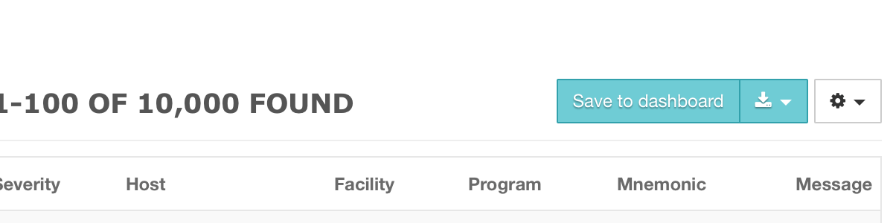
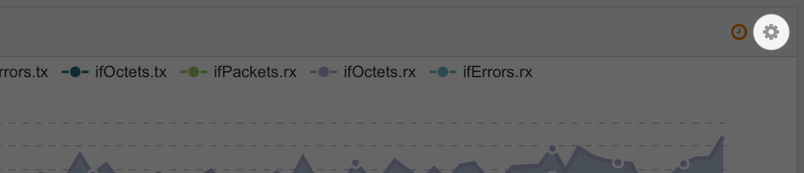
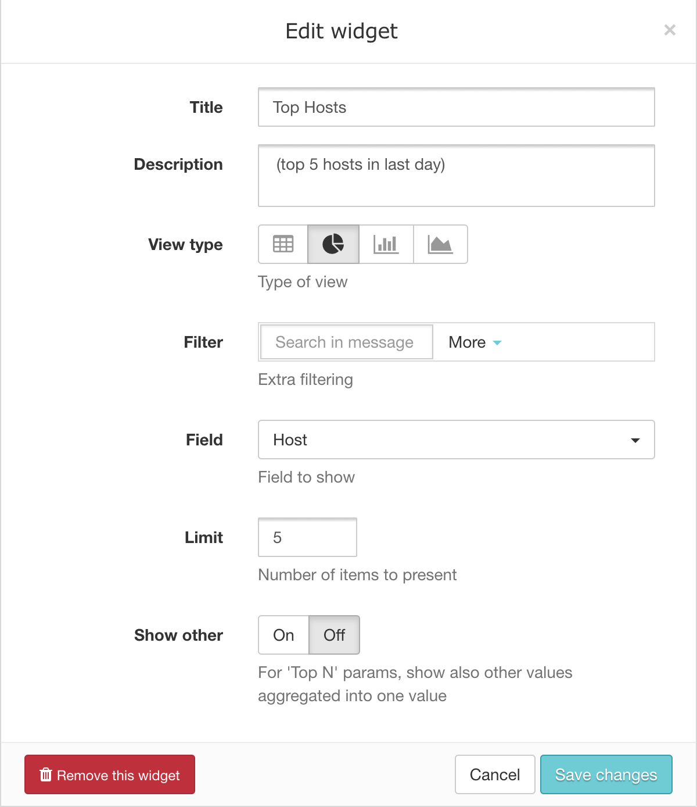
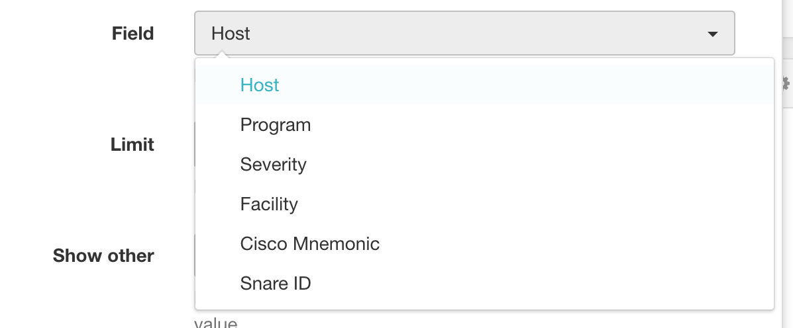
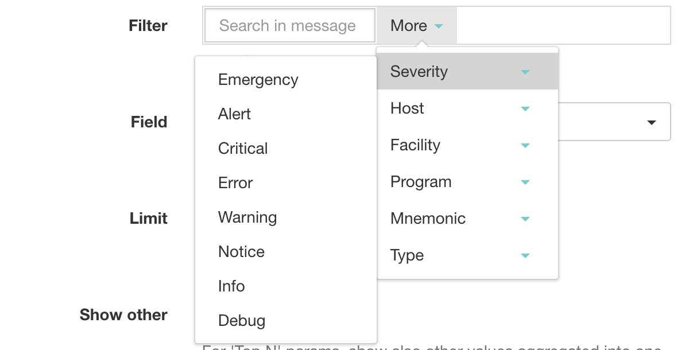
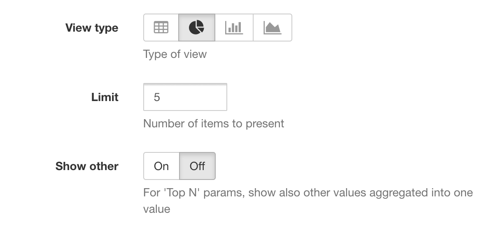
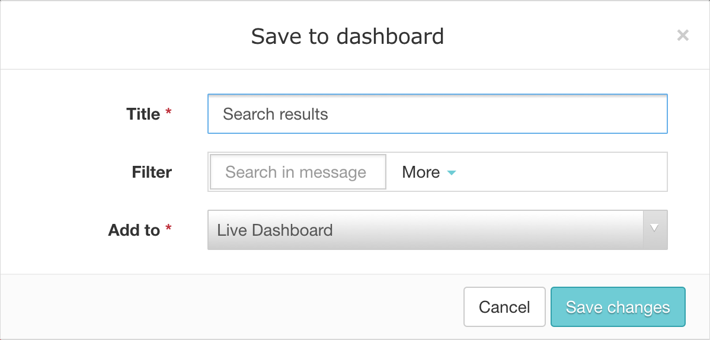
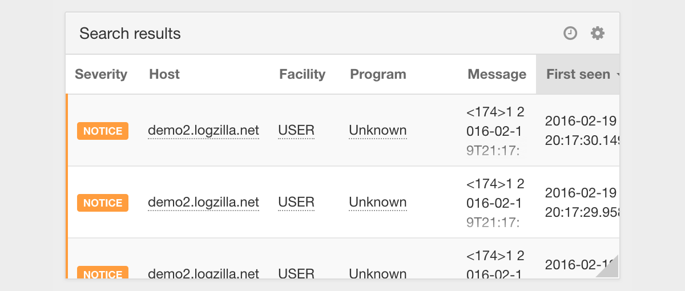

<!-- @@@title:Creating your own widgets@@@ -->

There are two ways to create your own widgets. The first is to select a pre-built widget, and change its' configuration to suit your needs. The second is to perform a search based on criteria that suits needs, and use the 'Save to dashboard' button on the results page.

---

**Customizing existing widgets** – There are too many ways to customize widgets to cover this subject completely, so we'll just provide an example to give an overview of the process.  We'll start with the TopN pre-built widget, Tops Programs.

By clicking the gear icon in the top right corner, we can access the widget settings.

By changing the Title, Description, and Field, we can easily turn this into a widget for showing our top severities.

You can also monitor your top Cisco Mnemonics, or add a search term like 'failed login'. The Title and Description need to be modified by the user to be clear about the information shown in the widget. The Field lets you decide what data you want to display.

The Filter section lets you narrow your results similarly to the main search bar in LogZilla. You add a search term, such as 'failed login', then select all of your Windows servers from the Host section. This will give you a widget that displays only failed login events generated by your Windows hosts. You can similarly filter your results by Severity, Facility, Program, Mnemonic, or Type (Unknown, Actionable, or Non-actionable). So, selecting all 'CONFIG' mnemonics would display configuration changes from your routers and switches.

The Limit allows you to control how many results are shown in your widget, while 'Show other' toggles the display of items that don't fit the standard categories of the selected filter. For example, for 'Top N' params, it will also show other values aggregated into one value. The final selection is 'View type', which allows you to select the chart type that best fits your other widget options.

---

**Creating widgets from search results** – If you find that you run a particular search on a regular basis, you can click the 'Save to dashboard' button. This will prompt you to name the widget and select the dashboard that it should be displayed on. You can also modify the search parameters or filters further, if needed.

The display will show updated information on a regular basis. This is ideal for keeping up with ongoing network issues, keeping an eye on intrusion attempts, or even know when users are locked out after consecutive failed logins.

