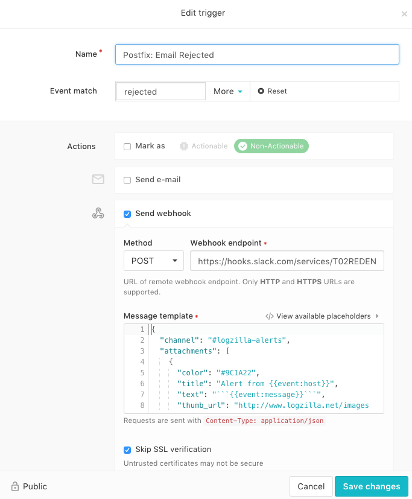
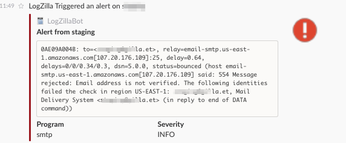

<!-- @@@title:Outgoing Webhooks@@@ -->

# Outgoing Webhooks

The Webhook option in the trigger menu allows users to send a `GET` or `POST` webhook command to a northbound server such as [slack.com](http://www.slack.com)

The example below shows a trigger set to match on `rejected` messages from Postfix. When the trigger matches, it will post to a Slack channel automatically.

Webhook Post to Slack
---


Alert Shown in Slack Channel
---



# Post Data Used
The Trigger above uses the following JSON:

    {
      "channel": "#logzilla-alerts",
      "attachments": [
        {
          "color": "#9C1A22",
          "title": "Alert from {{event:host}}",
          "text": "```{{event:message}}```",
          "thumb_url": "http://www.logzilla.net/images/icon_warning_25x25.png",
          "fallback": "Alert from {{event:host}}",
          "author_icon": "http://www.logzilla.net/images/log_file_icon_25x25.png",
          "pretext": "LogZilla Triggered an alert on {{event:host}}",
          "author_link": "mailto:support@logzilla.net",
          "fields": [
            {
              "value": "{{event:program}}",
              "title": "Program",
              "short": "true"
            },
            {
              "value": "{{event:severity}}",
              "short": "true",
              "title": "Severity"
            }
          ],
          "mrkdwn_in": [
            "text",
            "fields"
          ],
          "author_name": "LogZillaBot"
        }
      ],
      "username": "logzilla-bot",
      "icon_url": "http://www.logzilla.net/images/logo_orange_png_cropped_40x40.png"
    }
