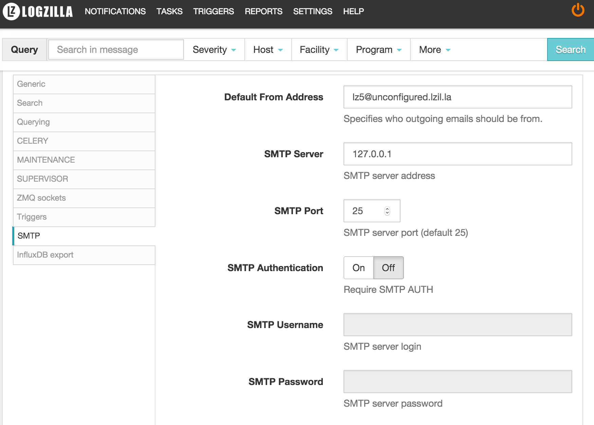

<!-- @@@title:Sending E-Mail From The Server@@@ -->

In order for LogZilla to be able to send email alerts, there must be a mail server configured in the `Settings` menu:

> If using the default `127.0.0.1`, you must have a local mail host installed which is capable of forwarding to a real mail server to deliver the mail.

>The following guide will help you configure Postfix to send using Gmail's SMTP. However, please note that these examples are here as an example only. It is up to your system administrator to set up email sending from the server.

### Forwarding mail using Gmail

Stop sendmail if it is running:

    service sendmail stop

Set up Postfix for relaying emails through another mail server

    apt-get -y install mailutils postfix
    cd /etc/postfix
    mv main.cf main.cf.orig

Add the following lines to main.cf by pasting the following command:

    cat << 'EOF' > /etc/postfix/main.cf
    # Map localhost.localdomain type emails to a real from: address
    smtp_generic_maps = hash:/etc/postfix/generic
    alias_maps = hash:/etc/aliases
    relayhost = [smtp.gmail.com]:587
    smtp_sasl_auth_enable = yes
    smtp_sasl_password_maps = hash:/etc/postfix/sasl_passwd
    smtp_sasl_security_options = noanonymous
    smtp_tls_CAfile = /etc/ssl/certs/ca-certificates.crt
    smtp_use_tls = yes
    inet_protocols=ipv4
    EOF

Set the authorized user/pass to communicate with the relay

> Replace username:password with your gmail username and password

    printf '[smtp.gmail.com]:587  username:password\n' > /etc/postfix/sasl_passwd

    chown root:root /etc/postfix/sasl_passwd
    chmod 600 /etc/postfix/sasl_passwd
    postmap /etc/postfix/sasl_passwd
    rm /etc/postfix/sasl_passwd

Change local "generic" system addresses to real email addresses so that the relay will accept them

>Replace root@localhost below with your gmail address

    export email="root@localhost" && printf "MAILER-DAEMON@`hostname`.localdomain $email\nwww-data@`hostname`.localdomain $email\nroot@`hostname`.localdomain $email\n" > /etc/postfix/generic

    postmap /etc/postfix/generic

Restart Postfix

    service postfix restart

Send Test Email

>Replace $email below with your gmail address

    echo "test email from `hostname`" | mail -s "test from `hostname`" $email

Check the `/var/log/mail.log`, you should see a status 250 for the mail you just sent:

    Oct  5 15:43:05 somehost postfix/qmgr[30130]: 89D054086E: from=<root@somehost.localdomain>, size=377, nrcpt=1 (queue active)
    Oct  5 15:43:06 somehost postfix/smtp[30316]: 89D054086E: to=<somedude@logzilla.net>, relay=xxx:25, delay=0.89, delays=0.07/0.02/0.59/0.21, dsn=2.0.0, status=sent (250 Ok 0000014189659bbc-ddd0a727-cab3-49fe-8560-c75a39130a5f-000000)
    Oct  5 15:43:06 somehost postfix/qmgr[30130]: 89D054086E: removed
