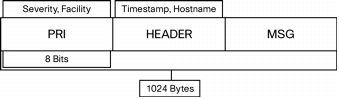

<!-- @@@title:Syslog Basics@@@ -->

# Syslog

Syslog is a client/server protocol originally developed in the 1980s by Eric Allman as part of the Sendmail project.

Syslog is defined within the syslog working group of the [IETF RFC 3164](https://www.ietf.org/rfc/rfc3164.txt) and is supported by a wide variety of devices and receivers across multiple platforms. 

## Senders
A syslog sender can be any type of device or software such as a Cisco, Juniper, HP, etc. Networking device, Operating Systems, and/or individual applications such as Antivirus Software, Web Servers, etc.

If the sender is using an [RFC 3164](https://www.ietf.org/rfc/rfc3164.txt) compliant format (the most common), it sends a small (less than 1KB) text message to the syslog receiver. 

### UDP Senders
Since UDP is, by design, "connection-less", it does not provide acknowledgments to the sender or receiver. Consequently, the sending device generates syslog messages without knowing whether the syslog receiver has actually received the messages. In fact, UDP-based senders will send events out even if the syslog server does not exist at the configured destination. Using UDP provides no "guarantee" of reception. For this reason, many (if not all) syslog senders will repeatedly send the same events over and over.

### TCP Senders
Many of today's devices, software, etc. can be configured to send using TCP instead of UDP in order to help ensure a more "guaranteed" delivery to the receiver. This is due to the TCP protocol's design in that it will establish a connection on both ends and allow for "handshakes" where both sender and receiver are aware that a message was both sent and acknowledged. When given the option, all systems capable of sending via TCP instead of UDP should be configured to do so.

> Note: TCP as the transport protocol does not lower the amount of duplicate events sent by the sender. It only guarantees (more than UDP) that the receiver is actually getting the events.

## Receiver

A syslog receiver, typically referred to as a "syslog daemon" listens on incoming network ports using UDP (typically on port 514/udp) or TCP (typically, port 514/tcp). While there are some exceptions such as [TLS encryption](https://en.wikipedia.org/wiki/Transport_Layer_Security), syslog data is sent in clear text over the network.

LogZilla utilizes Balabit's industry-standard [syslog-ng](https://syslog-ng.org) daemon to receive messages and forward them to LogZilla's architecture.

## Relays
Relays are used to forward logs from local networks to remote networks. This is the most reliable and common way to ensure message reception on your primary server when utilizing a wide-area network. For help configuring a relay, refer to the [Relays](/help/receiving_data/relays) section.

# Syslog Message Format and Contents

The full format of a syslog message seen on the wire has three distinct parts:

• PRI (priority)
• HEADER
• MSG (message text)

For RFC 3164 compliant events, the total length of the packet cannot exceed 1024 bytes. There is no minimum length.

## Syslog PRI Code
The Priority field is an 8-bit number represents both the `Facility` and `Severity` of the message. The three least significant bits represent the Severity of the message (with three bits you can represent eight different Severities), and the other five bits represent the Facility of the message.

> Note: Syslog Daemons (running on the syslog receiver) do not generate these Priority and Facility values. The values are created by the syslog sender (applications or hardware) from which the event is generated.

### Syslog Facilities

Syslog messages are broadly categorized on the basis of the sources that generate them. These categories, referred to as `Facilities`, are represented by integers in the syslog packet. The `local` facilities are not reserved; the processes and applications that do not have pre-assigned Facility values may choose any of the eight local use facilities. 

| Integer | Facility                                 |
|---------|------------------------------------------|
| 0       | Kernel messages                          |
| 1       | User-level messages                      |
| 2       | Mail system                              |
| 3       | System daemons                           |
| 4       | Security/authorization messages          |
| 5       | Messages generated internally by Syslogd |
| 6       | Line printer subsystem                   |
| 7       | Network news subsystem                   |
| 8       | UUCP subsystem                           |
| 9       | Clock daemon                             |
| 10      | Security/authorization messages          |
| 11      | FTP daemon                               |
| 12      | NTP subsystem                            |
| 13      | Log audit                                |
| 14      | Log alert                                |
| 15      | Clock daemon                             |
| 16      | Local use 0 (local0)                     |
| 17      | Local use 1 (local1)                     |
| 18      | Local use 2 (local2)                     |
| 19      | Local use 3 (local3)                     |
| 20      | Local use 4 (local4)                     |
| 21      | Local use 5 (local5)                     |
| 22      | Local use 6 (local6)                     |
| 23      | Local use 7 (local7)                     |

### Syslog Severities

The log sender (device or software generating the message) specifies the severity of that message using single-digit integers 0-7 

> Note: When configuring your sending device or application, the recommended logging levels are 0-6 under normal operation, level 7 (debug) should only be used for local troubleshooting on that system.

| Integer | Facility                                 |
|---------|------------------------------------------|
| 0       | Emergency: System is unusable            |
| 1       | Alert: Action must be taken immediately  |
| 2       | Critical: Critical conditions            |
| 3       | Error: Error conditions                  |
| 4       | Warning: Warning conditions              |
| 5       | Notice: Normal but significant condition |
| 6       | Informational: Informational messages    |
| 7       | Debug: Debug-level messages              |

 