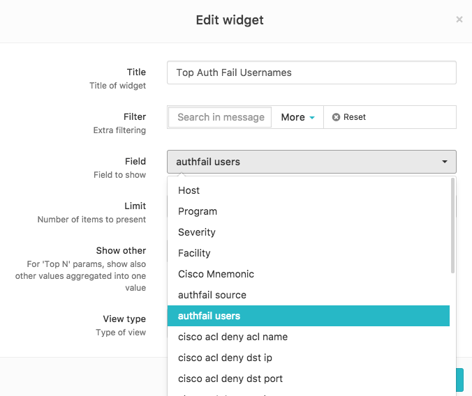
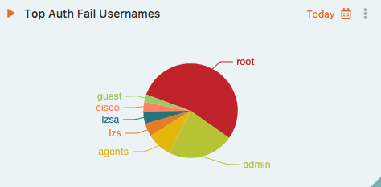

<!-- @@@title:User Tags@@@ -->


# User Tags
LogZilla's [Rewrite Rules Feature](/help/data_transformation/rewrite_rules) also allows the extraction and "tagging" of any arbitrary data extracted from events.

>For more examples please be sure to check our [GitHub Page](https://github.com/logzilla/extras/tree/master/parsers) which also contains any recently added rules submitted by the community but not implemented in the software yet.


# Extracting Insight From Arbitrary Data

User Tags allow extraction and transformation of any arbitrary data from incoming events in order to obtain insight from various metrics such as:

* Device types
* Users
* Locations
* GeoIP
* Authentication Failures
* Audit Log Tracking
* Malware Types/Sources/Destinations

These are only a few of the thousands of possibilities of what users are able to extract as tags from LogZilla's [rule parser](/help/data_transformation/rewrite_rules).

"User Tags" makes it possible to extract and track any information which may provide insight into day-to-day NetOps, SecOps, DevOps, etc. functions. 

For example, given a list of incoming events such as:

```
%AUTHPRIV-3-SYSTEM_MSG: pam_aaa:Authentication failed for user bob from 10.87.8.1
Log-in failed for user 'agents' from 'ssh'
```

It is easy to extract and track the name of the users as well as the source  address of that user:

* Create a new rule such as `/etc/logzilla/rules.d/failed-login-tracking.json`
* Add the pattern match and user tag of your choice
* Set the rule to mark this event as `actionable` in the system (note that statuses may also be set as `non-actionable`).

```json
{
  "rewrite_rules": [
    {
      "comment": "Auth Fail User Tracking",
      "match": {
        "field": "message",
        "op": "=~",
        "value": "for (?:user)? '?([^\\s']+)'? from '?([^\\s']+)'?"
      },
      "tag": {
        "ut_authfail_users": "$1",
        "ut_authfail_source": "$2"
      },
      "update": {
        "status": "actionable"
      }
    }
  ]
}
```

* Read the new rule in using `~logzilla/src/bin/lz5rules --reread`
* Add a new `TopN` widget to any dashboard (such as `Top Hosts`) and edit that widget to select the newly created user tag field:


**User Tags Field Selector**




* Your `TopN` chart will now display the Top Authentication Failed Usernames

**Top Auth Fail Usernames chart**



# Match/Update Based on Tags

It is also possible to set a custom tag, then use that tag in the same rule or even other rules files. If a tag-based match/update is used, that tag should be created first of course. If created in another rule file, be sure that the rule file containing the new tag comes first alphabetically. For example:


**001-rule.json - create the tag based on a message match:**

```json
{
  "rewrite_rules": [
    {
      "comment": [
        "Extract denied List Name, Protocol and Port Numbers from Cisco Access List logs",
        "Sample Log: Oct 4 22:33:40.985 UTC: %SEC-6-IPACCESSLOGP: list PUBLIC_INGRESS denied tcp 201.166.237.25(59426) -> 212.174.130.30(23), 1 packet"
      ],
      "match": {
        "field": "message",
        "op": "=~",
        "value": "list (\\S+) denied (\\S+) \\d+\\.\\d+\\.\\d+\\.\\d+\\((\\d+)\\).+?\\d+\\.\\d+\\.\\d+\\.\\d+\\((\\d+)\\)"
      },
      "tag": {
        "ut_cisco_acl_deny_acl_name": "$1",
        "ut_cisco_acl_deny_src_proto": "$2",
        "ut_cisco_acl_deny_src_port": "$3",
        "ut_cisco_acl_deny_dst_port": "$4"
      }
    }
  ]
}
```

**002-rule.json - use the tag created in 001-rule.json to map port numbers to names:**

```json
{
  "first_match_only": true,
  "rewrite_rules": [
    {
      "comment": "Match on previously created Cisco ACL tags and convert the port numbers extracted stored in that same tag to a name for ports 22, 23, 80 and 443",
      "match": {
        "field": "ut_cisco_acl_deny_dst_port",
        "value": "22"
      },
      "tag": {
        "ut_cisco_acl_deny_dst_port": "ssh"
      }
    },
    {
      "match": {
        "field": "ut_cisco_acl_deny_dst_port",
        "value": "23"
      },
      "tag": {
        "ut_cisco_acl_deny_dst_port": "telnet"
      }
    },
    {
      "match": {
        "field": "ut_cisco_acl_deny_dst_port",
        "value": "80"
      },
      "tag": {
        "ut_cisco_acl_deny_dst_port": "http"
      }
    },
    {
      "match": {
        "field": "ut_cisco_acl_deny_dst_port",
        "value": "443"
      },
      "tag": {
        "ut_cisco_acl_deny_dst_port": "https"
      }
    }
  ]
}
```

* Note: This is just an example - both of the above rules files could also have beeen combined into a single file.


# Caveats/Warnings

* Tag names are free-form allowing any alphabetic characters. Once a messages matches the pattern, the tag is automatically created in the API, then made available in the UI. If a tags is created but does not show up in the UI, it may simply mean there have been no matches on it yet. (note: users may want to try a browser refresh to ensure a non-cached page is loaded).


* Tags **must** begin with `ut_` and be all **lowercase**. Any `_`'s in the tag name will be converted to a `space character` when displayed in the UI.

* Tagging highly variable data may result in degradation or even failure of metrics tracking (not log storage/search) based the capability of your system. This is due to cardinality limitations in InfluxDB. [The following article](http://puyuan.github.io/influxdb-tag-cardinality-memory-performance) outlines this limitation in more detail. Care should be taken to keep the number of tags below 100k entries.

The following script may be used to obtain the number of series being tracked by the UT feature:


```bash
#!/bin/bash
for key in $(influx -database lz5aggregates -format 'csv' -execute 'SHOW TAG KEYS' | cut -d ',' -f2 | tail -n +2)
do
    echo -n "${key},"
    influx -database lz5aggregates -format 'csv' -execute "SHOW TAG VALUES FROM aggregates with key=${key}" | wc -l
done
```

# Tag Performance
As with any large amount of data stream manipulation, performance degradation can happen depending on many variables such as CPU, Memory, Disc I/O, and, of course, the way the rules are presented to the parsing engine.

## Ensuring Good Rule Performance
When writing large rulesets, it may be useful to use a *precheck* match to match on a string before matching on a large regular expression pattern. The *precheck* in this context is not a special type, rather, it is the same syntax as a *match* type, but uses `eq` (string) instead of `=~` (regex). This also ensures that "generic" regex patterns don't match on a message it was not intended for. 

The example below shows how to use a `eq` match (string match) for the incoming event. Then, if the string matches, a more complex regex (`=~`) match may be used.

> Note: the "comment" area below is free-form. We typically use it to help "document" a message type along with a sample log in case someone wants to test it later. 

```json
{
  "rewrite_rules": [
    {
      "comment": [
        "Vendor: HP Aruba",
        "Type: Hardware",
        "Category: 802.1x",
        "Description: This log event informs the number of auth timeouts for the last known time for 802.1x authentication method.",
        "Sample Log: <NUMBER_OF> auth-timeouts for the last <TIME> sec."
      ],
      "match": [
        {
          "field": "message",
          "value": "auth-timeouts for the last",
          "op": "eq"
        },
        {
          "field": "message",
          "op": "=~",
          "value": "\\S+ auth-timeouts \\S+ \\S+ \\S+ \\S+ sec .*"
        }
      ],
      "update": {
        "program": "HP_Switch"
      },
      "tag": {
        "ut_vendor": "HP",
        "ut_category": "802.1x",
        "ut_type": "hardware"
      }
    }
  ]
}
```

### Bad Regex
It's important to make sure that the regex used is the most efficient. This will go a long way when using 1000's of rules. In the example above, a *prematch* should not even be used (but was for demonstrative purposes only). A much better method for the example above would have been to **not** use a prematch and simply use a better regex pattern such as `\\S+ auth-timeouts for the last \\S+ sec`. 

> Be sure to use a tool such as [RegEx101](https://regex101.com) to make sure your patterns work and that they perform well.

### Testing
A command line tool found in `/home/logzilla/src/bin/lz5rules` may be used to perform various functions including:

* list   -             List rewrite rules
* reload  -            Reload rewrite rules
* add    -             Add rewrite rule
* remove   -           Remove rewrite rule
* enable   -           Enable rewrite rule
* disable   -          Disable rewrite rule
* performance   -      Test rules single thread performance

When a new json file is added to `/etc/logzilla/rules.d/` simply running `/home/logzilla/src/bin/lz5rules reload` is sufficient to both test and load the new rule into LogZilla. There is no need to restart LogZilla itself.

